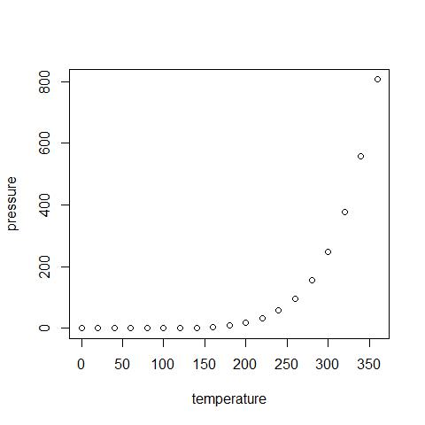

ECON 700 Main Page
================
Bob McNab
2025-09-28

- [Test](#test)
- [Including Plots](#including-plots)

## Test

I am testing ECON 700.

For more details, see econ 700.

Trying to figure this out.

``` r
x <- 5
y <- 10
print(x*y)
```

    ## [1] 50

When you click the **Knit** button a document will be generated that
includes both content as well as the output of any embedded R code
chunks within the document. You can embed an R code chunk like this:

``` r
summary(cars)
```

    ##      speed           dist       
    ##  Min.   : 4.0   Min.   :  2.00  
    ##  1st Qu.:12.0   1st Qu.: 26.00  
    ##  Median :15.0   Median : 36.00  
    ##  Mean   :15.4   Mean   : 42.98  
    ##  3rd Qu.:19.0   3rd Qu.: 56.00  
    ##  Max.   :25.0   Max.   :120.00

## Including Plots

You can also embed plots, for example:

<!-- -->

Note that the `echo = FALSE` parameter was added to the code chunk to
prevent printing of the R code that generated the plot.
